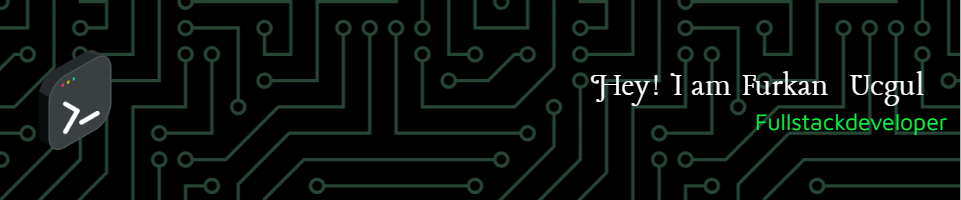

  

- 🔭 I’m currently working on **Full Stack Technologies**
- 🌱 I’m currently learning **Advanced React and Node.js**
- 👯 I’m looking to collaborate on **Open Source Projects**
- 💬 Ask me about **React, TypeScript, and .NET**
- 📫 How to reach me **furkanucgull@gmail.com**

<h3 align="left">Connect with me:</h3>

  
  

<h3 align="left">Languages and Tools:</h3>

 
   
   
   
   

  <h1 align="center">  Some of my Projects </h1> 

# AI Help Bot App

This is an AI-powered chatbot application designed to answer user questions and provide assistance. Leveraging advanced AI technologies like OpenAI's GPT model, it generates intelligent and instant responses to user queries in natural language. The project focuses on modern web technologies and AI integration to deliver a user-friendly experience.

## Technologies Used

- **Next.js**: Used for server-side rendering and static site generation, ensuring fast load times and SEO optimization.
- **TypeScript**: Added static type checking to improve code quality and reduce runtime errors.
- **Tailwind CSS**: Enabled rapid and responsive UI development with utility-first CSS.
- **GraphQL**: Provided a flexible and efficient API for querying data.
- **StepZen**: Simplified the creation and management of the GraphQL API, enabling seamless integration with backend services.
- **Clerk Authentication**: Implemented authentication and user management with secure and scalable solutions.
- **Vercel**: Used for fast and reliable deployment of the Next.js application.

## Key Features

- Natural Language Processing (NLP) to understand and respond to user queries.
- Modern and user-friendly interface.
- Secure user authentication using Clerk.
- Dynamic and intelligent responses powered by AI integration.
- Scalable and extensible architecture.

**Project Goal:**  
This project aims to combine AI and modern web technologies to provide quick and effective solutions to users' daily questions. It also serves as a great opportunity to enhance my skills in AI integration and full-stack development.

<h3 align="left">About Me:</h3>

  When I'm not coding, I enjoy playing video games, reading tech and science blogs, and exploring new technologies. I'm currently learning **Node.js** and **GraphQL** to expand my backend development skills. I'm also an active member of the local developer community, where I participate in hackathons and tech meetups. I'm always eager to learn and share knowledge with others.

